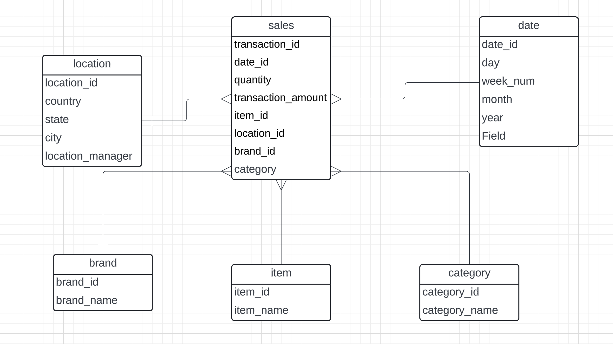

#### Input sales table

* SaleTransactions
    * Transaction_id
    * Date
    * Date
    * quantity
    * Transaction_amount
    * item_id
    * item_name
    * Brand_name
    * category_name
    * location_id
    * country
    * state
    * city
    * location_manager

#### Requirements:

**The responsible managers need to be able to analyze how many sales quantity as well as the transaction amounts.**

**They would also like to be able to analyze the hours by Month, Quarter and Year. You are free to create an additional table for that if necessary**

#### Your job:

As a first step you should identify dimensions and facts - and define what dimension tables and fact tables you would create.

You can use PowerPoint or other tools (or just pen and paper) and upload the image - or just write it in text:

using Star schema modelling

