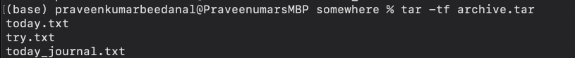
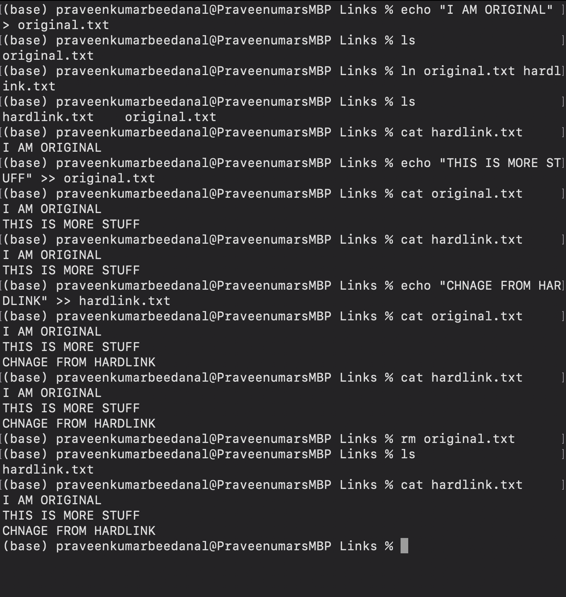
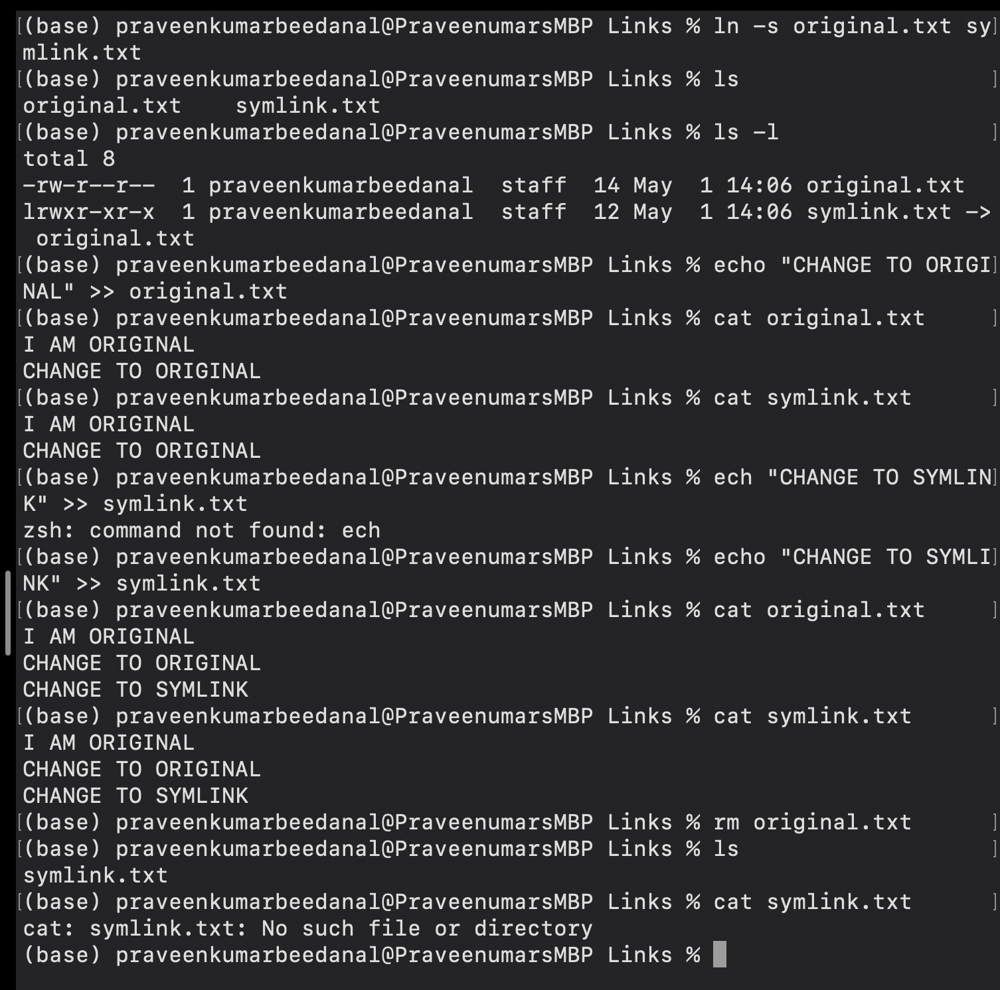
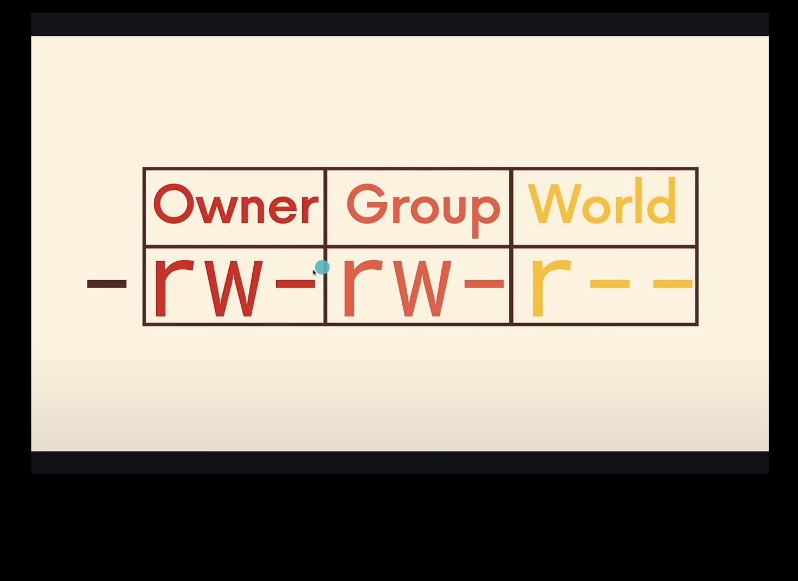
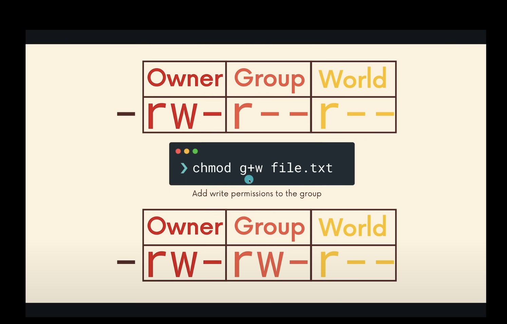
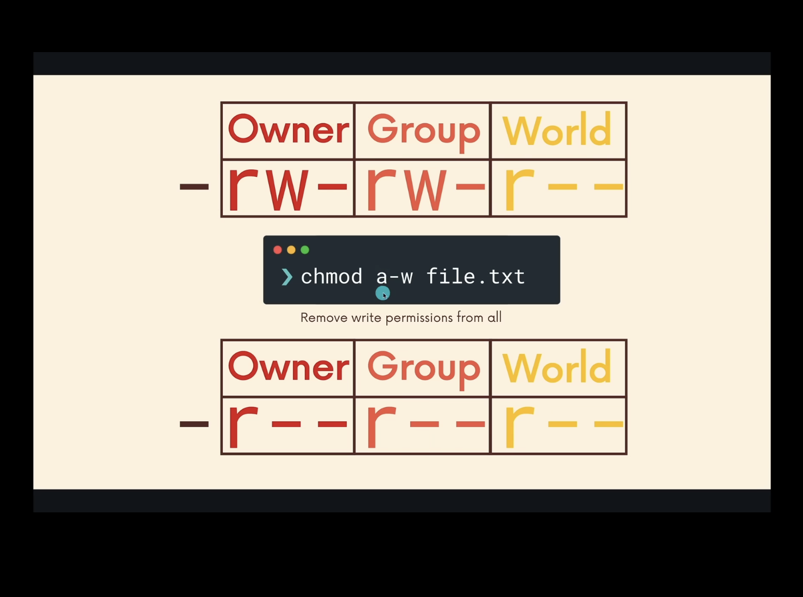

### advanced commands -- reference(https://www.freecodecamp.org/news/the-linux-commands-handbook/)

1. jobs
    * check for jobs running in background
    * `jobs`
    * `sleep 50 &` -- runs job in background by adding '&' at the end
    * to make it run in foreground run -- `fg`

2. fg
    * resume jobs in foreground

3. bg
    * resume jobs in background

4. sleep
    * suspends execution of sometime
    * `sleep 2` -- 2 seconds suspends

5. gzip
    * compress file using gzip algorithm 
    * `gzip -kv changes.txt` -- keep the original file and print verbose, output 'changes.txt.gz'

6. gunzip
    * decompress or unzip the zipped files back into original structure
    * `gunzip changes.txt.gz`

7. tar
    * create an archive, grouping multiple files into single file
    * `tar -cf archive.tar today.txt try.txt today_journal.txt` -- doesn't compress just create the 'archive.tar' file
    * `tar -tf archive.tar` -- display files in archive
    
    * look into reference handbook for more options

8. nano
    * friendly text editor
    * `nano filename`

9. alias
    * allows own aliases, mean custom the commands
    * `alias myls='ls -la'`
    
    * alias is not permanent, it's available only within current session or terminal
    * to persist alias, store it in .bash_profile file, so .bash_profile runs each time terminal opens
    * `alias count=echo {1..99}` -- when i write 'count', prints 1 to 99 numbers

10. xargs
    * take output from one command and turn it to argument for another command
    * only some commands takes input from | from pipes
    * some commands doesn't use |, eg, rm command. it expects the arguments
    * eg;`cat deadplayer.txt | xargs rm` , takes the input from cat and provide as argument to rm command

11. ln
    * similar to windows shortcuts. icon on desktop
    * file that points to another file
    * hardlink
        * doesn't copy the content of file to another file
        * `ln original.txt hardlink.txt`
           
        * once we remove original.txt, hardlink.txt still present
    * softlink
        * `ln -s original.txt symlink.txt`
        
        * once we remove original.txt, symlink.txt also got removed

12. who
    * displays the logged in user on the server
    * `who`

13. su
    * switch the user
    * `su <username>`

14. sudo
    * super user do
    * run command as root user
    * `sudo nano /etc/hosts` -- super user do run the nano command

15. passwd
    * use to change someone passwd or our own passwd
    * `sudo passwd elvis` -- changing the password for elvis
    * `passwd` -- change own password

16. chown -- change ownership
    * owner of the file allows to delete, change permission
    * `chown <owner> <file_name>`
    * `chown -R kitty catStuff` -- recursively change the ownership of folders, subfolders and files
    
    
17. chmod
    * change the permission of file or directory
    
    * above image says add write permission to group
    
    * above image says, remove write permissions for all

IMPORTANT COMMANDS

