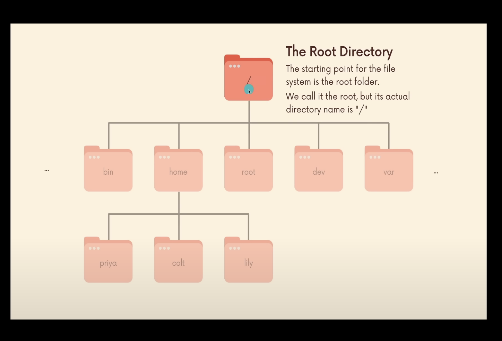

### Basic Commands

1. Whoami 
    * display the id of the logged user

2. man 
    * display manual documentation of the command
    * eg; `man man` or `man clear`

3. clear
    * clears the screen
    * `clear -x` -- clears the screen, but you can scrool through the history

4. pwd 
    * print working directory

5. ls 
    * list the directory content
    * useful options for ls commands
        * `ls -l`  -- list files long format
        * `ls -a`  -- includes files starts with .(dot file)
        * `ls -la`  -- displays all files in long format

6. cd
    * change directory
    * eg; `cd Downloads/job_search`
    * if you want to back one level `cd ../..`
    * `cd ~` -- change to home directory
    
7. Absolute paths
    * all absolute paths starts with **'/'** root directory
    * we can't go above  **'/'**, since it's the root
    

8. mkdir
    * use to create directory/folder
    * eg; `mkdir Downloads/Greenhouse`
    * If we want to create **seeds** inside **summer** directory, but currently there is no **summer** directory in **Greenhouse** folder. 
        * To do this use `mkdir -p summer/seeds`, -p Create intermediate directories as required.

9. touch
    * create empty files
    * eg; `touch apple.txt`
    * if file exists, modify the timestamp of file

10. rmdir
    * removes only empty directories
    * eg; `rmdir deleteme searchme`

11. rm
    * removes files and directories
    * eg; `rm carrot cat`, wants have verbose? `rm -v carrot cat`
    * remove directory which has content, then use `rm -r seeds`
    * remove files interactively then use, `rm -ri seeds`

12. open
    * open files or directories in MAC
    * eg; `open .` -- open in finder
    * `open apple.pdf`  -- opens the pdf file in default pdf viewer

13. mv
    * rename the files and move files around
    * eg; `mv jornal.txt journal.txt`
    * move files into folders, `mv joUrnal.txt Stuff/`
    * move multiple files into folders, `mv cake cookie pie Stuff `
    * rename the folder name, `mv Stuff STUFF`  

14. cp
    * copy the files
    * `cp joUrnal.txt today_journal.txt`
    * copy the folder and it's content `cp -r STUFF STUFF_COPY`

15. head
    * prints first 10 lines of file by default
    * eg; `head songs.txt`
    * eg; `head -n 100 songs.txt` -- prints 100 lines

16. tail
    * prints last 10 lines of file by default 
    * eg; `tail songs.txt`
