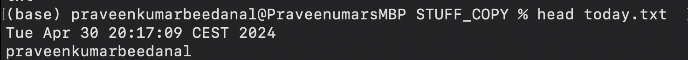

### Intermediate commands

1. date
    * prints the current date and time

2. >
    * redirect the commands output to file instead of command line
    * eg; `date > today.txt` -- it overwrites the content of today.txt with current date and time
    * creates **today.txt** if it doesn't exists

3. >>
    * it also redirects the output of command to file, but instead of overwrite it appends to file
    * eg; `whoami > today.txt` -- content of today.txt
    
    * it also creats file if it doesn't exists

4. cat
    * concatenate and prints the file
    * eg; `cat today.txt` -- prints the file content to terminal
    * eg; `cat today.txt whoami.txt > concatenates` -- prints both file content one after another and save to **concatenates** file
    
    * `cat -n today.txt` -- prints along with line number

5. less
    * interactive way of displaying the file on the screen
    * allows forward and backward movement of file
    * `less big_file.txt`

6. echo
    * prints it back the user provided text
    * eg; `echo 'hello'`, `echo 'username=Praveen' > config.txt`

7. wc
    * returns word, line, character, and byte count of input file or text
    * eg; `wc -w today.txt` -- prints no of words in file
    * `wc -l today.txt` -- prints no of lines in file
    * `wc -c today.txt`  -- prints no of bytes in file

8. | -- piping
    * output of one command to another command
    * eg; `ls -l | wc` -- output of list files to word count command
    * prints lines, words and byte counts
    

9. sort
    * sorts the information
    * eg; `sort abcd.txt` -- sort lexiographically
    * eg; `sort -n numbers.txt` -- if we want to sort the number pass -n options, 
    * to reverse add -r, and get unique sort result use -u
    * eg; `sort -nu numbers.txt | wc -l` -- count no of unique numbers in file

10. uniq
    * report or filter out repeated lines in a file
    * necessary to sort the file first before passing it uniq, because it always checks adjacent to remove duplicates
    * eg; `sort duplicates.txt | uniq`
    * `sort duplicates.txt | uniq -d` -- prints only duplicate rows
    * `sort duplicates.txt | uniq -u` -- prints unique rows
    * `sort duplicates.txt | uniq -c` -- prints count of each rows
    * `sort duplicates.txt | uniq -c | sort -n` -- sort the rows count
 
 
11. expansions 
    * eg; `echo ~`, here tilda is expansion
    * `echo $PATH`, here path is the environment variable , it's also the expansion
    * **path name expansions**
        * `echo *` -- prints all the files and folders in current directory
        * `echo *.txt` -- prints only .txt files
        * `echo app.??` -- matches files starts with app. and two letter extensions
        * `echo Day{1..365}.txt` -- prints 1 to 365 numbers, we can create files using `touch Day{1..365}.txt`
    
12. diff
    * to find difference between 2 files
    
    * 1c1 - line 1 on file 1 changed line 1 on file 2

13. find
    * used to find files or folders matching the pattern
    * eg; `find . -name '*c*'` -- find files which has c in there name
    * `find . -type d` -- finds the directories
    * `find . -type f` -- finds the files in the current directories
    * lot more things refer the handbook

14. grep
    * search inside the file
    * eg; `grep praveen today.txt` -- search for praveen inside file
    * eg; `grep -n praveen today.txt` -- prints line number along with search line
    * `grep -nC 2  praveen today.txt` -- prints 2 line before and after search string
    * `grep -r praveen .` -- search recursively in the current directory

15. du
    * disk usage of files or directory
    * `du -mh ~/Downloads` -- prints the file size in human readable format

16. df
    * display disk space of the system
    * `df -h` -- whole system disk space
    * `df -h Downloads`

17. history
    * shows the history of the commands you ran previously
    * eg; `history | less` -- shows history commands in less page viewer

18. ps
    * display information about running processes in the system
    * 
    * `ps ax` -- to look for all process running in the system(both user ran and inbuilt system processes)

19. top
    * opens new window and shows top most cpu intesive process
    * eg; `top`
    * eg; `top -o mem` -- memory intesive processes

20. kill
    * not just used to terminate the program
    * `kill <pid>` -- sends terminate signal(SIGTERM) to processes
    * SIGTERM -- sends terminate signal
    * SIGKILL -- brutal which kills the proccess

21. killall
    * similar to kill, instead sending signal to process id sends to multiple processes
    * `killall -SIGKILL node` -- name of the proccess is 'node'
    